# README

## TSI_RL_HighwayMerge
Assignment on the course Topics on Intelligent Systems (MSc in Artificial Intelligence, 1st semester)

## A little context
### Overview
The aim of this project was to replicate and enhance a paper related to the relation of Multi-Agent Systems and Machine Learning. The chosen paper was "Deep Multi-Agent Reinforcement Learning for Highway On-Ramp Merging in Mixed Traffic". This project that can be viewed on the following GitHub repository: [MARL_CAVs](https://github.com/DongChen06/MARL_CAVs?tab=readme-ov-file)

### The paper
The paper explores the application of multi-agent reinforcement learning (MARL) to address the challenges of highway on-ramp merging in mixed traffic scenarios involving autonomous vehicles (AVs) and human-driven vehicles (HDVs). A decentralized MARL framework is proposed, enabling AVs to learn safe and efficient merging policies while adapting to dynamic HDV behaviors. The problem is modeled in a gym-like simulation environment with varying traffic densities (easy, medium, hard). Key components include a state space capturing vehicle positions, speeds, and distances; an action space comprising acceleration, deceleration, and lane changes; and a reward function incentivizing safety and efficiency. To enhance learning and safety, the framework incorporates parameter sharing for scalability, action masking to exclude unsafe actions, and a priority-based safety supervisor to manage merging urgency. 

## Training Environment
### On the paper
- **Simulated Scenario**: The model was trained in a highway environment with two main lanes and one merging lane, replicating real-world traffic conditions.

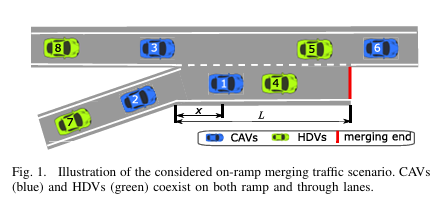

#### Key Features and Techniques:
- **Action Masking**: Unsafe actions, such as leaving the highway boundaries, were disabled during training to ensure the agents' safety and focus on valid maneuvers.
- **Curriculum Learning**: While mentioned as a potential enhancement, this technique—progressively introducing more complex scenarios—was not implemented in this study.
- **Priority-Based Safety Supervisor**: This innovative mechanism evaluated the safety of lane-changing actions by predicting potential collisions up to 8 steps ahead, ensuring that only safe actions were executed.
- **Shared Network**: A shared network structure allowed the agents to learn collectively, improving training efficiency and leveraging shared experiences among them.

These components contributed to creating a robust framework for training autonomous vehicles to merge safely and efficiently in challenging highway scenarios.

### **Improvements on the Original Framework**

The goal of our approach was to recreate and enhance the study presented in the paper, incorporating additional features and modifications to improve learning efficiency, safety, and adaptability in highway merging scenarios.

#### **Curriculum Learning Implementation**:  
   While the paper mentioned curriculum learning, it was not implemented in the original study. We introduced this technique to facilitate faster and safer learning by gradually increasing the difficulty levels:
   - **Difficulty Level 1**: Controlling 1 to 3 vehicles in a simple environment.
   - **Difficulty Level 2**: Controlling 2 to 4 vehicles, increasing complexity.
   - **Difficulty Level 3**: Controlling 4 to 6 vehicles, representing more challenging scenarios.

 #### **PPO Model**:  
   We opted for the Proximal Policy Optimization (PPO) algorithm, as it showed superior baseline performance compared to A2C in the paper’s benchmarks. PPO is known for its stability and efficiency in reinforcement learning tasks.
   
#### **Reward Function Adjustments**
We experimented with different reward adjustments to evaluate their impact on agent performance:
- **Collision Penalty**: Adjusted from -200 to -100 and -1000 to study the influence on safety.  
- **Speed Incentive**: Increased from 1 to 2 and 4, promoting faster but controlled driving.  
- **Penalty for Staying in the Merging Lane**: Modified from 4 to 2 and 6 to encourage quicker merging.  
- **Proximity Penalty**: Incentivized maintaining a safe distance from the car in front, the distance is multiplied by 4, and variations of 2 and 6 will be tested to optimize behavior.

#### **Environment Modifications**
To expand the study, we explored different highway configurations:
- **Single Lane**: Simplifying the environment to focus on merging behavior.  
- **Three-Lane Highway**: Increasing complexity for more realistic scenarios.

### **Performance Metrics**
We analyzed the agents' performance based on:
- **Average Speed**: To evaluate efficiency.  
- **Collision Rates**: To measure safety and identify reward structures yielding optimal results.

### **Additional Features**

1. **Behavioral Variations in Non-Controlled Vehicles**:  
   To test the adaptability of our model, we introduced diverse driving styles for vehicles not controlled by the agent. These behaviors were defined as follows:  
   - **Aggressive Behavior**:  
     - Higher desired maximum acceleration.  
     - Higher deceleration capability to minimize unnecessary braking.  
     - Reduced desired distance to the vehicle in front.  
     - Shorter time gap to the vehicle ahead.  
     - Lower minimum acceleration gain required to initiate a lane change.  
     - Increased maximum braking force imposed on other vehicles during lane changes.  
     - Shorter time allowed to reach maximum acceleration.  
   - **Cautious Behavior**:  
     - Lower desired maximum acceleration.  
     - Lower deceleration capability to avoid abrupt stops.  
     - Increased desired distance to the vehicle in front.  
     - Higher time gap to the vehicle ahead.  
     - Higher minimum acceleration gain required to initiate a lane change.  
     - Reduced braking force imposed on other vehicles during lane changes.  
     - Longer time allowed to reach maximum acceleration.  

2. **Creative Idea – Delivery Vehicles ("Couriers")**:  
   Inspired by real-world delivery objectives, we designed a scenario simulating vehicles with delivery tasks, prioritizing speed and efficiency. These "couriers" exhibited the following characteristics:  
   - **Rewards and Behavior Adjustments**:  
     - Increased high-speed reward (from 1 to 3) to incentivize faster movement.  
     - Shorter time allowed to reach maximum acceleration, enabling quicker starts.  
     - Faster reaction times for lane changes, optimizing their ability to navigate traffic.  
     - Increased allowed speed (from 30 to 40), reflecting the urgency of reaching their destination.  
   - The agents aimed to achieve high speeds and efficient maneuvers while minimizing disruptions to surrounding traffic, striking a balance between aggressive and safe driving.  

## Results
### Model comparison
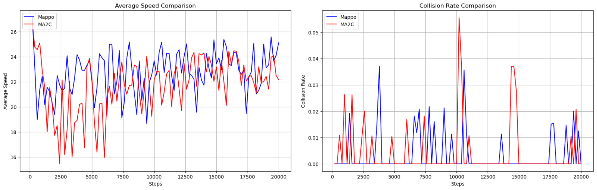

Our chosen model achieved a higher average velocity among all the cars and, in terms of collision, exhibited low peaks, achieving results comparable to the paper's model. Overall, Mappo demonstrated the best performance due to its ability to enhance average velocity, maintaining traffic flow, and reduce the number of collisions.

### Reward Shaping

1. **Collision Penalty**:
   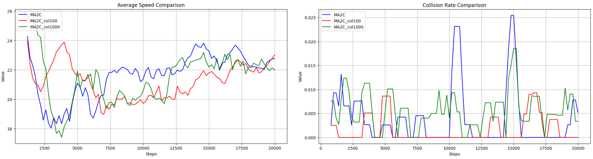

Having a low penalty on collision (100) led to better results on both graphs. As the penalty increased, the average velocity decreased. The collsion rate was very low with the lower reward, but the other values also performed well, achieving very few collisions. Based on this, we chose a penalty value of 100 for further testing.
   
2. **High Speed Reward**
   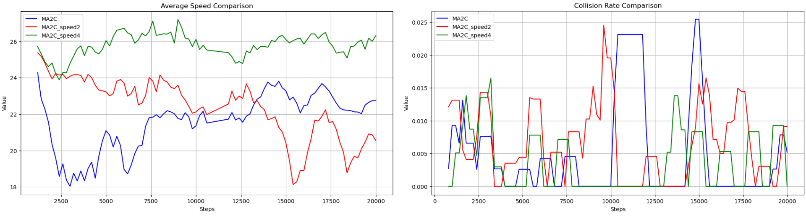

As expected, higher speed reward resulted in a higher average velocity, while the collision rate remained low. This suggests the conclusion that higher speed do not necessarily lead to more collisions. Based on the results, we chose a reward value of 4 for further testing.

3. **Headway Penalty**
   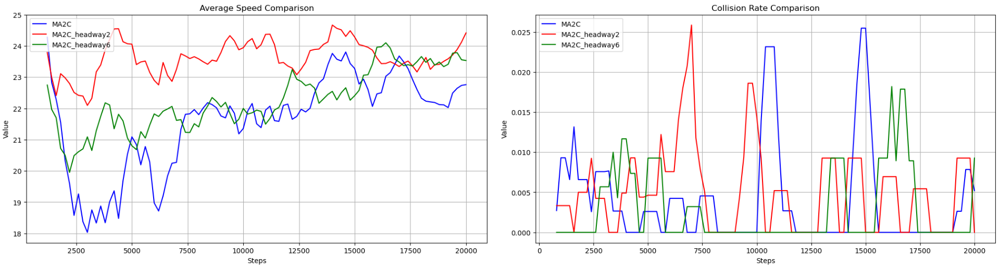

Both adjustments led to improved average velocity, but the lower penalty value produced the best result. The number of collisions was lower even with reduced penalization when vehicles were close to each other. Based on these results, we selected a penalty value of 2 for further testing.

4. **Merge Lane Penalty**
 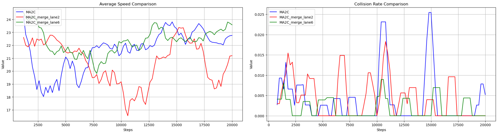

With the increase in the penalty, the cars achieved higher average velocity, likely due to the necessity to merge faster onto the highway and them speed up. Both penalty adjustments resulted in fewer collisions. Once again, we selected the penalty value that yielded the best results, which in this case was 6.

### Environment Changes

Here, we compared the paper's model with our approach across diferent environments. In Mappo, our approach utilized the optimal rewards identified through reward shaping, while the paper's model retained its original rewards.

1. **1 lane environment**
 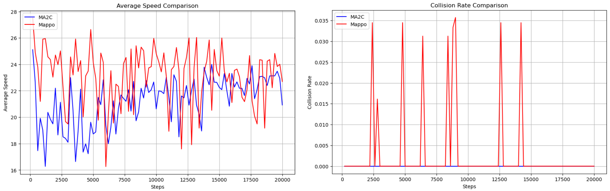

Our approach demonstrated better results in terms of average speed. In this environment with only one highway lane, the merge was performed effectively, maintaining the traffic flow. The collision rate fluctuated significantly during training but ultimately achieved a result similar to that of the paper's model.

2. **2 lanes environment**
 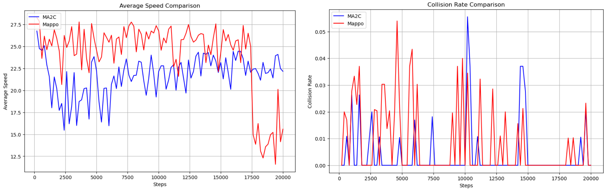

Mappo initially showed promising results but experienced a drastic decline in the average speed towards the end. In terms of collisions, both models fluctuated during training but ultimately achieved similar outcomes. 

To investigate the drastic drop in average speed, we explored potencial explanations. One possibility is that the rewards previously identified were effective on an individual basis but, when combined, could lead to outcomes like this. Another explanation is that the model became confident in its decisions up to that point and began exploring alternative set of actions.

3. **3 lanes environment**
   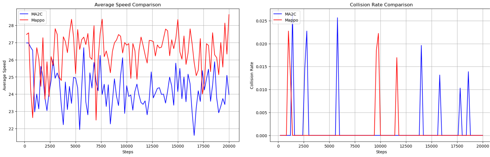

Mappo exhibit a substantial increase in average speed, demonstrating strong adaptability to a different scenario. The collision rate was low, which was expected, as the increased space likely kept the right lane clearer for merging vehicles.  

### Behaviour Changes
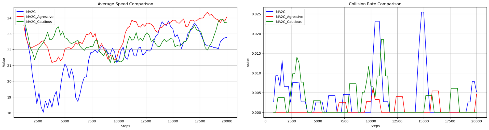

Both behaviour changes yielded good results, with higher average speeds and lower collision rates. As expected, the model with more agressive vehicles experienced more collisions compared to the one with cautious vehicles. However, the model adapted to the agressive behaviour and ultimately achieved better results than the original.

### Creative Approach ("Couriers")
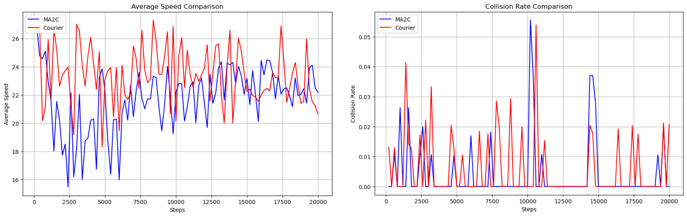

It started well but ultimately achieved a lower average speed than the original. In terms of collisions, it experienced a few, which, while not optimal, were expected due to the changes made to prioritize faster arrival at the destination. 

Overall, this approach requires further refinement, both in the reward structure and in the new methods, to more effectively simulate courier behaviour.

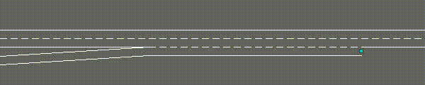
  

## Setup

### Create a Python Virtual Environment

`conda create -n marl_cav python=3.6 -y`

### Activate the Virtual Environment

`conda activate marl_cav`

### Install PyTorch (torch>=1.2.0) and its sddociated libraries

`conda install pytorch==1.7.0 torchvision==0.8.1 torchaudio==0.7.0 -c pytorch`

### Install Additional Requirements

`pip install -r requirements.txt`

## Usage

### Training a Model

`python run_xxx.py`

### Evaluating a Trained Model:

`python run_xxx.py --option eva --model-dir path_to_model`

Replace `path_to_model` with the path to the directory containing your trained model.

